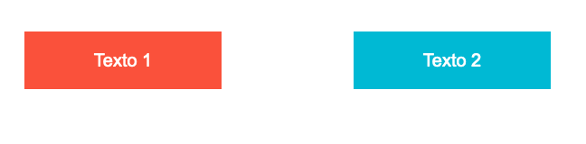
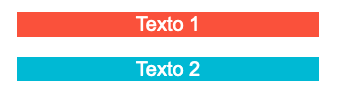
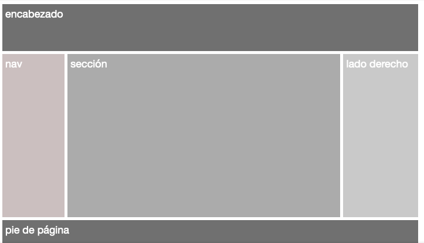
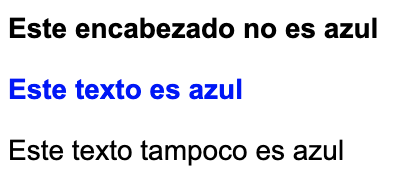
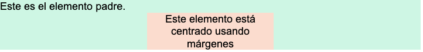
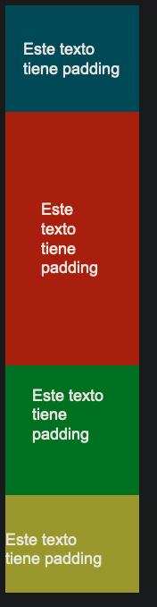
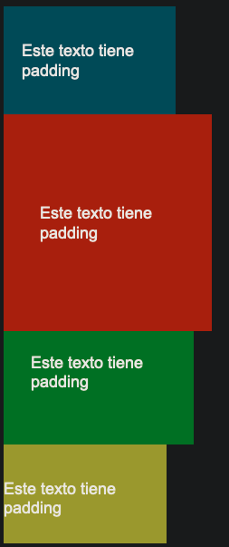

# CSS

- Los cambios de los estilos se aplican en orden de cascada (de arriba hacia abajo)
- El valor por defcto de cualquier elemento es <i>auto</i>
- Para asegurar que un elemento de diseño sea responsivo se deben usar unidades de medida relativas como porcentajes, em, rem, vh, vw
- Se deberia asegurar que cada elemento tenga propiedades maximas y minimas establecidas con: <i> min-height, max-height, min-width, max-width</i>. Con esto se asegura que un elemento este en un rango visible

## Media Queries

Las media queries o consultas de medios permiten cambiar ciertos aspectos CSS cuando ocurre cierta condición. Se implementan con la regla de CSS <i>@media</i>. Típicamente se utilzan para cambiar el estilo cuando una pantalla llega a cierta anchura

```html
<!-- HTML -->

<div id="container">
    <div class="row">
        <div class="col one">
            <p>Texto 1 </p>
        </div>
        <div class="col two">
            <p>Texto 2 </p>
        </div>
    </div>
</div>
```

```css
/* CSS */

.col{
    font-size: 20px;
    font-family: Arial, sans-serif;
    text-align: center;
    color:#fff;
    float:left;
    margin: 10%;
    width: 30%;
}

.one{
    background-color: #e95b33;
}

.two{
    background-color: #40b7d7;
}

@media screen and (max-width: 400px) { 
    .col{
        float: none;
        margin: 0 auto;
        width: 80%;
    }
}
```




Otros Ejemplos

```css
@media screen and (min-width: 30em) and (orientation: landscape) {
  /* … */
}

@media (min-height: 680px), screen and (orientation: portrait) {
  /* … */
}
```

## Fuente de Fuentes

[Google Fonts](https://fonts.google.com/)

## Pseudo - Clases

Una pseudoclase CSS es una palabra clave que se añade a los selectores y que especifica un estado especial del elemento seleccionado. Por ejemplo, :hover aplicará un estilo cuando el usuario haga hover sobre el elemento especificado por el selector.

```css
selector:pseudoclase { propiedad: valor; }
```

La siguiente lista muestra las psudo-clases estandar:

- :active
- :checked
- :default
- :dir()
- :disabled
- :empty
- :enabled
- :first
- :first-child
- :first-of-type
- :fullscreen
- :focus
- :hover
- :indeterminate
- :in-range
- :invalid
- :lang()
- :last-child
- :last-of-type
- :left
- :link
- :not()
- :nth-child()
- :nth-last-child()
- :nth-last-of-type()
- :nth-of-type()
- :only-child
- :only-of-type
- :optional
- :out-of-range
- :read-only
- :read-write
- :required
- :right
- :root
- :scope (en-US)
- :target
- :valid
- :visited

## Unidades

### Unidades Absolutas

<dl>
<dt>Pixeles</dt>
<dd>Se define con px. Un píxel es la unidad más pequeña de medición de una pantalla o imagen digital</dd>
<dt>Centímetros (no recomendado)</dt>
<dd>Se define con cm</dd>
<dt>Milímetros (no recomendado)</dt>
<dd>Se define con mm</dd>
<dt>Pulgadas (no recomendado)</dt>
<dd>Se define con in</dd>
</dl>

### Unidades Relativas

<dl>
<dt> em </dt>
<dd> Esta unidad es relativa al tamaño de fuente del elemento. Es decir, si tenemos un tamaño de fuente de 14px, entonces 2em = 28px.</dd>
<dt> rem </dt>
<dd> Similar a em, rem es relativa al tamaño de fuente del elemento raíz, o sea el elemento html </dd>
<dt> Porcentajes </dt>
<dd> Definidos con el símbolo %, hacen referencia al elemento padre, es decir, al contenedor del elemento. Si usamos un margen de 50%, entonces será de la mitad del tamaño del contenedor. </dd>
<dt> vh </dt>
<dd> Es una unidad relativa a la altura del viewport (el espacio en donde está el contenido), donde una unidad 1vh equivale a 1% de la altura de nuestra ventana. </dd>
<dt> vw  </dt>
<dd> Es una unidad relativa al ancho del viewport, donde una unidad 1vw equivale a 1% del ancho de la ventana</dd>
</dl>


## Posicionamiento 

### Flex-Box

[Juego Flex](https://flexboxfroggy.com/#es)

"Caja Flexible" es una propiedad que se utliza para que los elementos se acomoden de acuerdo al tamaño de página. Para utilizarla, se tiene que agregar <i>display: flex;</i> al elemento padre, con esto todos los elementos dentro del elemento se convertiran en cajas flexibles, y se les podrá aplicar una serie de propiedades. Existen propiedades flex para el contenedor y para los hijos; las propiedades del contenedor afectan todos los hijos. 

#### Las propiedades del contenedor flex son:

<dl>
<dt> flex-direction </dt>
<dd> Cambia la dirección en la que se acomodan los elementos. La predeterminada es <i>row</i>, la cual acomoda a los elementos de manera horizontal de izquierda a derecha <dd>
<dt> flex-wrap </dt>
<dd> Si el contenido no cabe en la dirección que se tiene entonces se "rodea" con el valor <i>wrap</i><dd>
<dt> align-items </dt>
<dd> Modifica cómo se alinean los elementos respecto a los demás<dd>
<dt> justify-content </dt>
<dd> Modifica cómo se justifica el contenido<dd>
<dt> align-content </dt>
<dd> Modifica cómo se alinean los elementos respecto al contenedor<dd>
</dl>

#### Propiedades de los elementos flex:

<dl>
<dt> align-self </dt>
<dd> Alinea sólo al elemento dentro del contenedor. Esta propiedad anulará la propiedad <i>align-items</i> sólo en el elemento<dd>
<dt> flex-grow </dt>
<dd> Especifica el tamaño con el que crecerá un elemento con respecto a los demás. Su valor predeterminado es 0<dd>
<dt> flex-shrink </dt>
<dd> Especifica el tamaño con el que decrecerá un elemento con respecto a los demás. Su valor predeterminado es 1<dd>
<dt> flex </dt>
<dd> Combina las tres propiedades anteriores<dd>
<dt> order </dt>
<dd> Cambia el orden de los elementos; el valor debe de ser un número, el más bajo va primero<dd>
</dl>

#### Display

Esta propiedad cambia la forma en la que se muestra el contenido. Tiene dos valores por defecto los cuales son: <i> inline </i> para objetos de línea (enlaces, spans, labels) y <i> block </i> para objetos de bloque (divisiones, párrafos, listas). Existen otros valores como <i> inline-block </i> que combina los dos anteriores

----

### Grid
[Explicacion Detallada](https://lenguajecss.com/css/maquetacion-y-colocacion/grid-css/)

[Juego Grid](https://cssgridgarden.com/#es)


- Contenedor: El elemento padre contenedor que definirá la cuadrícula o rejilla.
- Ítem: Cada uno de los hijos que contiene la cuadrícula (elemento contenedor).
- Celda (grid cell): Cada uno de los cuadritos (unidad mínima) de la cuadrícula.
- Area (grid area): Región o conjunto de celdas de la cuadrícula.
- Banda (grid track): Banda horizontal o vertical de celdas de la cuadrícula.
- Línea (grid line): Separador horizontal o vertical de las celdas de la cuadrícula.

<br>

Grid es una propiedad más avanzada pues permite estilizar el espacio como una cuadrícula la cual tiene dos dimensiones, usando filas y columnas. Para implentarlo, se utiliza <i> display: grid;</i> y después se tiene que especificar los tamaños de las filas y columnas con las propiedades: <i>grid-template-rows</i> y <i>grid-template-columns;</i> puedes especificar uno o ambos. Esto se puede hacer de diferentes maneras, ejemplos:

- grid-template-rows: 100px 1fr;
  
  Dos renglones, uno de 100px y otro de 1fr. (fr es una unidad exclusiva de grid).

- grid-template-rows: minmax(100px, 1fr);

    La función minmax nos da un rango mínimo y máximo de valores que puede tener el renglón o columna.

- grid-template-rows: repeat(3, 200px);
  
    La función repeat repite los valores. El primer número indica la cantidad de veces a repetir y el segundo el tamaño, por lo que en este caso tendremos tres renglones de 200px.

<br>
Otras propiedades que se pueden aplicar a un contenedor grid son:

- grid-row-gap Especifica el espacio entre cada renglón.
- grid-column-gap Especifica el espacio entre cada columna.
- grid-gap Especifica el espacio entre cada renglón y columna.

<br>
Estas propiedades se utlizan en los elementos del contenedor para especificar el espacio del grid que tomarán:

- grid-column-start Indica la columna en la que comenzará el elemento.
- grid-column-end Indica la columna en la que terminará el elemento.
- grid-row-start Indica el renglón en el que comenzará el elemento.
- grid-row-end Indica el renglón en el que terminará el elemento.
- grid-area Se utiliza para los 4 anteriores. También puede utilizarse con <i>grid-template-areas</i> para especificar áreas del grid a utilizar

Ejemplo

```html
<!-- HTML -->

<header>encabezado</header>
<nav>nav</nav>
<section>sección</section>
<aside>lado derecho</aside>
<footer>pie de página</footer>
```

```css
/* CSS */

body { 
    font-family: segoe-ui_normal;
    color: white;
    font-size: 18px;
    display: grid;
    grid-template-areas: 
        "header header header"
        "nav section aside"
        "footer footer footer";
    grid-template-rows: 80px 1fr 50px;
    grid-template-columns: 15% 1fr 18%;
    grid-gap: 5px;
    height: 100vh;
    margin: 10px;  
}

header {
    background: #707070;
    grid-area: header;
}

nav {
    background: #C9BFBF;
    grid-area: nav; 
}

section {
    background: #ABABAB;
    grid-area: section;    
}

aside {
    background: #C9C9C9;
    grid-area: aside; 
}

footer {
    background: #707070;
    grid-area: footer;
}

header, nav, section, aside, footer {
    padding: 5px;
}
```



----

Para cualquier elemento se dispone de la etiqueta <i>position</i>

<table>
<tr>
<td> static </td>
<td> posicionamiento predeterminado (de arriba a abajo) </td>
</tr>
<tr>
<td> relative </td>
<td> El elemento permanece donde esta pero puede ser afectado por las propiedades <i> top botom left </i> y <i>right</i></td>
</tr>
<tr>
<td> absolute </td>
<td> Muestra al elemento en una posición absoluta dentro de su elemento padre/contendor. A diferencia de relative, los elementos alrededor de un elemento absoluto no se reposicionan alrededor de su posición inicial</td>
</tr>
<tr>
<td> fixed </td>
<td> Permite que el elemento se mantenga visible en la ventana en todo momento (incluso después desplazar la página)</td>
</tr>
<tr>
<td> sticky </td>
<td> Se comporta como relative hasta que comienza a "salirse" de la ventana. Ahí es cuando se comporta como fixed, manteniendo su posición en la parte superior de la ventana hasta que su elemento padre deje de estar visible</td>
</tr>
</table>

### Float

Ubica un elemento al lado izquierdo o derecho de su contenedor, permitiendo a los elementos de texto y en línea aparecer a su costado. Los posibles valores son <i> none, left, right, inline-start, inline-end</i>

<table>
<tr>
<td> left </td>
<td> El elemento debe flotar a la izquierda de su bloque contenedor </td>
</tr>
<tr>
<td> right </td>
<td> El elemento debe flotar a la derecha de su bloque contenedor </td>
</tr>
<tr>
<td> none </td>
<td> El elemento no deberá flotar </td>
</tr>
<tr>
<td> inline-start </td>
<td> El elemento debe flotar en el costado de inicio de su bloque contenedor </td>
</tr>
<tr>
<td> inline-end </td>
<td> El elemento debe flotar en el costado de término de su bloque contenedor </td>
</tr>
</table>

## Colores

Los colores se manejan con codificacion hexadecimal de 6 digitos, RGB o HSL

### HSL

- El primer valor es matiz, valor entre 0 y 359
- Saturacion, porcentaje de 0 a 100%
- Luminosidad , porcentaje de 0 a 100%

<table>
<tr>
<th> hexadecimal </th>
<th> RGB </th>
<th> HSL </th>
</tr>
<tr>
<td> #1234AB </td>
<td> rgb(0, 0, 0)</td>
<td> hsl(123, 100%, 0%)</td>
</tr>
</table>

#### NOTE: 
Cuando se desea cambiar su opacidad o transparencia se usa la codificacion RGBA o HSLA, en donde a es un valor entre 0 y 1, el 0 es totalmente transparente y 1 es color solido

<table>
<tr>
<th> RGBA </th>
<th> HSLA </th>
</tr>
<tr>
<td> rgba(0, 0, 0, 0.5)</td>
<td> hsl(123, 100%, 0%, 0.5)</td>
</tr>
</table>

### Gradiente

linear-gradient(#ffffff, #8D848461);

### Algunas Propiedades que son mofidicadas con color

<table>
<tr>
<td> color </td>
<td> Especifica el color del texto </td>
</tr>
<tr>
<td> background-color </td>
<td> Especifica el color del fondo </td>
</tr>
<tr>
<td> border-color </td>
<td> Especifica el color del borde </td>
</tr>
<tr>
<td> box-shadow </td>
<td> Añade una sombra al contenedor con el color especificado </td>
</tr>
<tr>
<td> text-shadow </td>
<td> Agrega una sombra del color especificado al texto </td>
</tr>
<tr>
<td> text-decoration-color </td>
<td> Cambia el color de la decoracion aplicada al texto </td>
</tr>
</table>

## ID

Selecciona un elemento unico dentro del documento HTML referenciado con ese atributo, si se desea cambiar el estilo de varios elementos se puede hacer con el atributo <i> class </i>

Los atributos <i> class </i> e <i> id </i> son globales, lo que quiere decir que se pueden usar en cualquier elemento HTML

- <b>#</b> para los <i>id</i> 
- <b>.</b> para los <i>class</i>

Se puede asignar varias clases a un elemento separando los nombres de las clases con espacio

#### NOTE:

- Las clases o psudo-clases tienen herencia, si una propiedad se establece a un elemento y si se declara un nuevo elemento dentro del anterio, este nuevo elemento heredara las propiedades del padre.
- Los elementos deben estar contenidos dentro de otro elemento para que se aplique las caracteristicas que se desean.

```html
  <!-- Html -->
  <div class="azul">
    <h1>Este encabezado no es azul<h1>
    <p>Este texto es azul</p>
  </div>    
  <p class="azul">Este texto tampoco es azul<p>
```

```css
/* CSS */

p, h1{
    font-size: 28px;
    font-family: Arial, sans-serif;
}

.azul p{
    color: blue;
}
```



## Margenes y padding

Los márgenes son la distancia que separa a un elemento de otro, mientras que el padding es la distancia del contenido de un elemento a su borde

- margin: 20px; y padding: 20px;
    
    Utilizar un solo valor modifica uniformemente los márgenes y padding en las 4 direcciones (arriba, abajo, izquierda y derecha).

- margin: 80px 40px; y padding: 80px 40px;
    
    Cuando utilizamos 2 valores, el primer valor corresponde a la distancia vertical y el segundo la horizontal.

- margin: 20px 100px 30px; y padding: 20px 100px 30px;
    
    Para 3 valores, el primer valor corresponde al margen o padding de arriba, el segundo a la distancia horizontal y el tercero al de abajo.

- margin: 20px 30px 10px 0px; y padding: 20px 30px 10px 0px;
    
    Si utilizamos 4 valores, el primer valor corresponde al margen o padding de arriba, el segundo al de la derecha, el tercero al de abajo y el cuarto al de la izquierda.

Si solo se desea modificar el margen o padding en una direccion especifica se usa:

- margin-left o padding-left: izquierda
- margin-right o padding-right: derecha
- margin-top o padding-top: arriba
- margin-bottom o padding-bottom: abajo

Las margenes tambien pueden aceptar otro valor <i> auto </i> el cual permite que el navegador calcule el valor, se usa comunmente para centrar elementos

```html
<!-- HTML -->

<div class="padre">
      Este es el elemento padre.
      <div class="hijo">Este elemento está centrado usando márgenes</div>
</div>
```

```css
/* CSS */

.padre{
    background-color: #D5F5E3;
}

.hijo {
    width: 30%;
    margin: auto;
    background-color: #F6DDCC;
    text-align:center;
}

body{
    font-size: 18px;
    font-family: Arial, sans-serif;
}

```


## Box-Sizing

box-sizing = border-box, se usa para que el padding que se agregue no aumente el tamaño del contenedor




## Enlaces

Estilizar enlaces es igual que estilizar texto. Por defecto, cuando se pone un enlace en HTML el texto cambia a color azul y se subraya. Se puede modificar su estilo utilizando las propiedades <i> text-decoration,  color </i>

También se puede modificar el estilo del enlace cuando el usuario hace clic sobre él o pasa el puntero sobre texto. Esto se logra a través de pseudoclases de CSS, que se utilizan para modificar un elemento sólo bajo ciertas condiciones. En los enlaces se utiliza la pesudoclase hover para modificar el texto cuando el usuario pasa el puntero del mouse sobre él.

```
a{
    font-size: 30px;
    text-decoration: none;
}

a:hover{
    color: red;
}
```

## Texto

- Para agregar fuentes a la pagina se pueden descargar (formato .tff) y vincular la fuente de la siguiente manera:

```css
@font-face {
   font-family: NombreDeLaFuente;
   src: url('NombreDeLaFuente.ttf');
}
```

- Otra forma de importar la fuente es utilizando la etiqueta <i> link </i> y copiando el link generado en <b>Google Fonts </b>
- Tambien se puede importar la fuente con el tag <i> @import </i> desde Html en la etiqueta <i> style </i> 

Despues de importada se usa en el elemento usando la propiedad <i>font-family = "NombreDeLaFuente"</i>

### Algunas propiedades del texto son las siguientes

<table>
<tr>
<td> color </td>
<td> Cambia el color del texto </td>
</tr>
<tr>
<td> font-size </td>
<td> Tamaño de la fuente </td>
</tr>
<tr>
<td> font-weight </td>
<td> Cambia el grosor de la fuente, toma valores como bold o light. Para utilizar estas variaciones de grosor hay que tenerlas descargadas o vinculados a tus archivos. </td>
</tr>
<tr>
<td> font-family </td>
<td> Cambia la familia de fuentes. Se utiliza como una lista separada por comas: si la primera fuente falla, se utiliza la segunda y así sucesivamente </td>
</tr>
<tr>
<td> text-decoration </td>
<td> Agrega decoración al texto. Por ejemplo, el valor de underline subraya al texto </td>
</tr>
<tr>
<td> text-align </td>
<td> Alinea al texto en su contenedor de diferentes maneras. Puede ser <i>left, right, center, justify </td>
</tr>
</table>