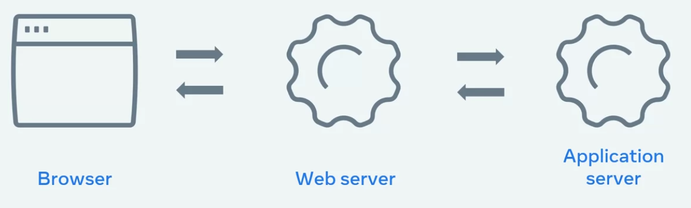

# Conceptos

- [Conceptos](#conceptos)
  - [Web Page, Web Site, Web App](#web-page-web-site-web-app)
    - [Web Page](#web-page)
    - [Web Site](#web-site)
    - [Web App](#web-app)
  - [Application Server](#application-server)
  - [Multi Page Applications](#multi-page-applications)
  - [Single Page Applications SPA](#single-page-applications-spa)
  - [Frameworks y Librerias](#frameworks-y-librerias)
  - [API (Application Programming Interface)](#api-application-programming-interface)
    - [Browser API o Web APIs](#browser-api-o-web-apis)
    - [Rest API o RESTful API](#rest-api-o-restful-api)
    - [Sensor-Based API](#sensor-based-api)

## Web Page, Web Site, Web App

### Web Page

Página web, una sola página que consta de HTML, CSS y javascript, muestra imagenes videos y otros contenidos en el navegador web

### Web Site

Colección de páginas web que se vinculan entre sí bajo un mismo nombre de dominio

### Web App

Los términos web site y web app se utilizan a menudo indistintamente, la diferencia radica en el nivel de interactividad y contenido dinámico, en otras palabras, un sitio web es más informativo, mientras que una aplicación web es más interactiva.

## Application Server

Servidor de aplicaciones o **back-end**, genera el contenido **dinámico** que el servidor web devuelve al navegador del usuario.

Realizan procesamientos más complejos que los servidores web, como ejecutar la lógica de la aplicación, conumicarse con la base de datos y verificar y comparar permisos

Note que los servidores de aplicación generalmente tienen un límite de solicitudes por segundo, se maneja con el almacenamiento caché del servidor web, lo que quiere decir es que mantiene una copia del contenido dinámico, ssi el contenido se vuelve a solicitar el servidor web lo puede enviar inmediatamente la versión en cache en lugar de transmitir una nueva solicitud al servidor de aplicaciones

## Multi Page Applications

Esta forma de diseño de páginas necesiten un uso intensivo de recursos de los servidores web, ya que el envío de paginas web completas para cada solicitud consume demasiado ancho de banda y utiliza tiempo de CPU para generar páginas dinámicas siendo inconveniente para usuarios con poco ancho de banda o cenexiones deficientes

## Single Page Applications SPA

No significa que hay solo una página de contenido, sino que hay solo una página HTML que se envía desde eñ servidor al navegador y actualizará el contenido a medida que los usuarios interactúen con el sitio web, es decir, reescribe la página web actual a medida que el usuario interactúa con ella

Una SPA tiene dos enfoques (formas) para proporcionar códico y recursos

- Bundling (Agrupación): Cuando el navegador solicita la aplicación el servidor devuelve y carga **todos** los archivos HTML, CSS y JavaScript necesarios inmediatamente
- Lazy Loading o code splitting (Carga diferida o división de código): El navegador solicita la aplicación y el servidor devuelve **solo los archivos mínimos necesarios** HTML, CSS y JavaScript para cargar la aplicación, los recursos adicionales se descargarán segín sea necesario

La elección depende del tamaño, complejidad y los requisitos de ancho de banda de la aplicación

## Frameworks y Librerias

- Librerias: son piezas reutilizables de código diseñandas para proporcionar una funcionalidad específica se consideran no doctrinales o no dogmáticos (**unopinionated**), esto se traduce a que el desarrollador va a tener más libertad de desarrollar sus funcionalidades
- Frameworks: Proporcionan la estructura a partir de la cual los desarrolladores pueden crear más rápido, generalmente los frameworks utilizan librerias. Los frameworks se consideran doctrinales o dogmáticos (**opinionated**), en contraste significa que el desarrollador se tiene que acomodar al estilo propuesto y paradigma del framework

- Express (Framework HTTP)
- Django
- ASP.NET
- Rails
- Spring

## API (Application Programming Interface)

Término intencionalmente abierto a muchas aplicaciones y casos de uso, las API suelen ser el puente entre diferentes componentes o sistemas con los que interactua una web app. También se les conoce como puerta de enlace (**gateway**) o software intermedio (**middleware**)

- Una APi es un conjunto de funciones y procedimientos para crear aplicaciones que acceden a las características o datos de un sistema operativo, aplicación u otro servicio.
- Un servicio, aplicación o interface que ofrece funcionalidad avanzada con una sintaxis simple

Algunas de las más comunes en el desarrollo web son

### Browser API o Web APIs

ej: DOM API, Geolocation API, Fetch API (obtener datos), Canvas API, History API (guardar el historial), Web Storage API (almacenamiento relacionado con el cliente **client-side**)

### Rest API o RESTful API

**Re**pretantional **S**tate **T**ransfer. Es un conjunto de principios que ayudan a contruir APIs altamente eficientes. Estas API proporcionan datos para aplicaciones web y móviles, también se les denomina servidores web

### Sensor-Based API

En ella se basa el internet de las cosas IoT. Se trata de sensores físicos que están interconectados entre sí. Los sensores pueden comunicarse entre sí y responder a los datos físicos, ej: luces inteligentes, bots de nodos de Philips Hue
