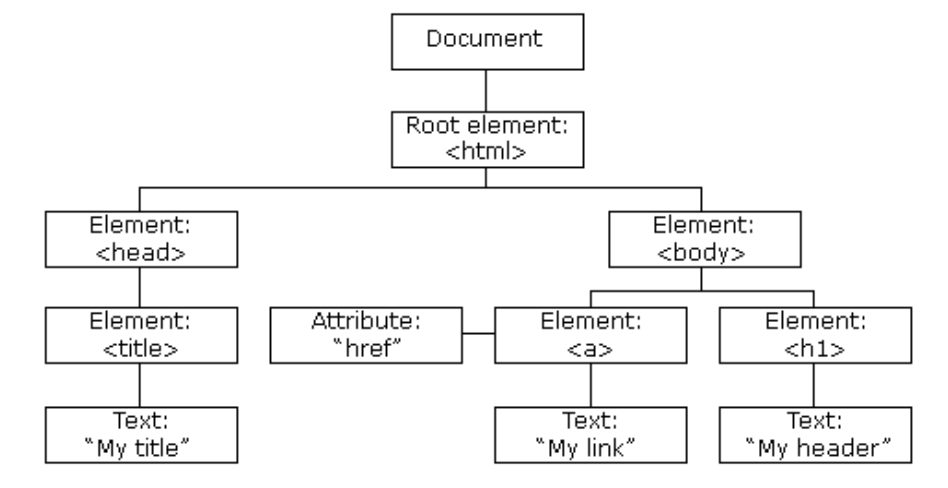
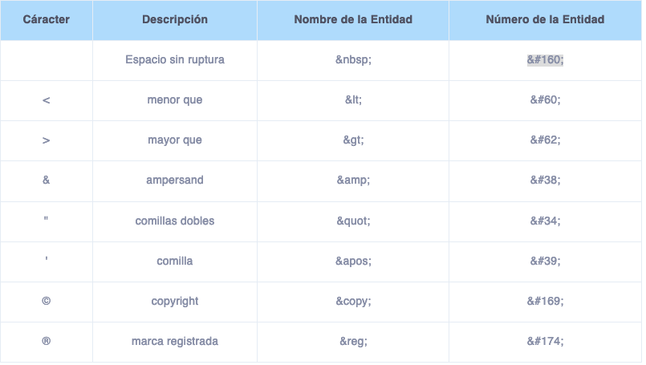

# HTML

## Frameworks

### Bootstrap

Nos brinda con cientos de funcionalidades que nos ahorran mucho tiempo de codificar, consiste en muchos archivos CSS, JavaScript y Sass (un framework de CSS) que nos permiten utilizar cientos clases para estilizar nuestros elementos

[Bootstrap](https://getbootstrap.com/)

### jQuery

jQuery es la librería de JavaScript más utilizada. Esta facilita la selección de elementos y la modificación dinámica de elementos. En jQuery se utiliza el caracter $ para seleccionar elementos. Por ejemplo, para obtener un elemento con un ID, escribimos el siguiente código

```javascript
var elemento = $("nombredelID");
```

[jQuery](https://jquery.com/)

### React

React es una poderosa librería de JavaScript que nos permite crear interfaces de usuario de manera más fácil y rápida. También permite crear y reutilizar elementos personalizados. React utiliza una sintaxis denominada JSX, que combina JavaScript y HTML para crear componentes. Una ventaja de esta librería es que cuenta con tutoriales y documentación en español

[React](https://es.react.dev/)

## DOM



Document Object Model, es la estructura del documento HTML, sus elementos, atributos, entre otros.

## Plantillas

[Plantillas Html Gratis](https://plantillashtmlgratis.com/)

[Open Source UI Elements](https://uiverse.io/)

## Eventos

```html
<button onclick="miFuncion()">Clic</button>
```

## Enlaces

El atributo target permite definir como se abre el enlace, por ejemplo, que el enlace se abra en una nueva pagina

```html
<a href="https://www.google.com.mx" target="_blank">¡Este enlace te lleva a Google!</a>
```

Navegacion en la misma pagina

En el atributo href, se pone un # y el id de algún elemento en nuestro documento HTML. 

## Imagenes

Etiqueta img, atributos como:

<dl>
    <dt> alt </dt>
    <dd> Define un texto alternativo por si la imagen no se carga adecuadamente </dd>
    <dt> width </dt>
    <dd> Define el ancho de la image </dd>
    <dt> alt </dt>
    <dd> Define la altura de la imagen </dd>
</dl>

### Recursos de Imagenes gratuitas

[Unsplash](https://unsplash.com/)

[Iconmonstr](https://iconmonstr.com/)

[Placeholder](https://placeholder.com/)

[Pexels](https://www.pexels.com/es-es/)

[Undraw](https://undraw.co/illustrations)

### Imagenes a partir de Inteligencia artificial ###

[Stable difusion en linea](https://stablediffusionweb.com/)

[Dall-E2](https://openai.com/dall-e-2)

## listas

Las listas pueden ser ordenadas, desordenadas y descriptivas

### Ordenadas

```html
<ol>
    <li> Primer elemento </li>
    <li> Segundo elemento </li>
    <li> Segundo elemento </li>
    <ol type = "a">
        <li> Sub elemento con otro ol </li>
        <li> Sub elemento con otro ol </li>
    </ol>
</ol>
```

Salida:

<ol>
    <li> Primer elemento </li>
    <li> Segundo elemento </li>
    <li> Segundo elemento </li>
    <ol type = "a">
        <li> Sub elemento con otro ol </li>
        <li> Sub elemento con otro ol </li>
    </ol>
</ol>

### Desordenadas

```html
<ul>
    <li> cafe </li>
    <li> verduras </li>
    <ul>
        <li> Lechuga</li>
        <li> Tomate</li>
    </ul>
</ul>
```

Salida:

<ul>
    <li> cafe </li>
    <li> verduras </li>
    <ul>
        <li> Lechuga</li>
        <li> Tomate</li>
    </ul>
</ul>

### Listas Descriptivas

```html
<dl>
<dt> Html </dt>
<dd> Lenguaje para definir los elementos de una pagina web</dd>
<dt> CSS </dt>
<dd> Lenguaje para definir el estilo de los elementos dentro de una pagina web</dd>
</dl>
```

Salida:

<dl>
<dt> Html </dt>
<dd> Lenguaje para definir los elementos de una pagina web</dd>
<dt> CSS </dt>
<dd> Lenguaje para definir el estilo de los elementos dentro de una pagina web</dd>
</dl>

## Input

Algunos tipos de input

- type="text" Muestra una caja de texto.
- type="password" Permite que el ususario escriba una contraseña (sin mostrar lo que escribió).
- type="radio" Se utiliza para preguntas de opción múltiple.
- type="checkbox" Es un recuadro que el usuario puede o no marcar.
- type="date" Pide una fecha al usuario.
- type="email" Le pide al usuario un correo electrónico en el formato adecuado: nombre_de_usuario@dominio.
- type="file" Permite que el usuario seleccione un archivo de su computadora
- type="submit" Se utiliza para el botón que envía la información del formulario al presionarlo.


## Formularios

Los formularios permiten obtener informacion del usuario para ser procesados ya sea en el servidor o en un javascript, se definen con la etiqueta form

```html
<form action="/manejarFormulario" method="POST">
    <label for="usuario">Usuario:</label>
    <input type="text" id="usuario" name="usuario" placeholder="Tu usuario"><br>
    <label for="pwd">Contraseña:</label>
    <input type="password" name="pwd" id="pwd"><br>
    <label>Sexo:<//label>
    <label for="hombre">Hombre</label>
    <input type="radio" name="sexo" id="hombre" value="hombre">
    <label for="mujer">Mujer</label>
    <input type="radio" name="sexo" id="mujer" value="mujer"><br>
    <label for="pais">País:</label>
    <select name="pais" id="pais">
    <option>Estados Unidos</option>
    <option>Canadá</option>
    <option selected>México</option>
    <option>Otro</option>
    </select> <br>
    <label for="terminos">Aceptas los términos</label>
    <input type="checkbox" name="terminos" id="terminos" value="aceptar"><br>
    <input type="submit" value="Enviar!">
</form>
```

## Iframes

Marcos que puede contener otra página o contenido web

```html
<iframe src="https://www.youtube.com/embed/yTr_3Q50orM" width="500" height="500" allow="accelerometer; autoplay; clipboard-write; encrypted-media; gyroscope; picture-in-picture"></iframe>
```

## Tablas

Se usan las etiquetas <i>tr</i> para definir filas, <i>th</i> para encabezados de tablas y <i>td</i> para celdas normales

## Entidades

