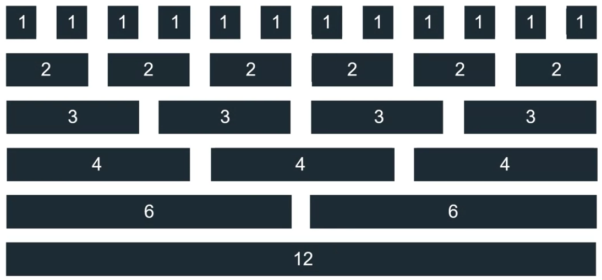
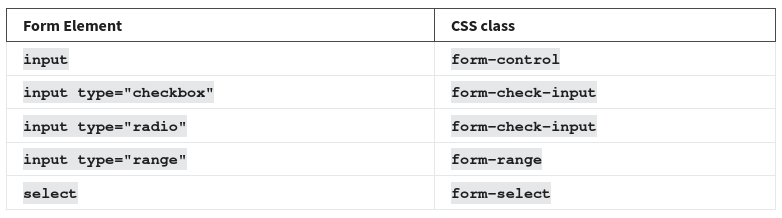

# Bootstrap

- [Bootstrap](#bootstrap)
  - [Grid](#grid)
  - [Breakpoints](#breakpoints)
  - [Modificadores](#modificadores)
    - [Lista de modificadores](#lista-de-modificadores)
  - [Bootstrap Components](#bootstrap-components)
    - [Forms](#forms)
    - [Switches](#switches)
    - [Input Groups](#input-groups)
    - [Floating Labels](#floating-labels)
  - [Bootstrap Themes](#bootstrap-themes)

[Get Started Bootstrap](https://getbootstrap.com/docs/5.3/getting-started/introduction/)

Libreria de CSS y JavaScript para estilar interface de usuario que ofrece **contenedores con clases** de estilo

El desarrollo web moderno se basa en componentes. Pequeños fragmentos de código reutilizables que permiten crear sitios web rápidamente. Bootstrap incluye varios componentes para una construcción muy rápida de varios componentes o partes de componentes.

Otro aspecto importante del desarrollo moderno son las cuadrículas responsivas **responsive grids**, que permiten que las páginas web adapten su diseño y contenido según el dispositivo en el que se visualicen. Bootstrap viene con un conjunto de reglas CSS predefinidas para crear una cuadrícula responsiva.

Bootstrap ahorra mucho tiempo porque todo el código CSS que le da estilo a su cuadrícula y a sus componentes prediseñados ya está escrito. En lugar de tener que tener un alto nivel de experiencia en varios conceptos CSS, puedes usar las clases CSS de Bootstrap existentes para crear sitios web de aspecto atractivo. Esto es indispensable cuando necesitas iterar rápidamente en los diseños de sitios web.

Para utilizar bootstrap debe agregarlo en el `head`, así como también una libreria Javascript que permite mayor funcionalidad como menus desplegables y tooltips

> [!NOTE]
> El script debe incuirlo sobre el final del `body` para que no afecte el rendimiento de la página

El sistema grid de Bootstrap requiere que el primer elemento que debe agregar es un div con la clase container `class="container"`

- `container`: es el elemento raíz de la cuadricula, su ancho se determina en función del breakpoint responsivo actual
- `row`: clase contenedora fila
- `col`: clase contenedora columna
- `img-fluid`: clase contenedora para imagenes que fija el ancho de acuerdo al ancho del contenedor
- `table`: clase para manejo de tablas

```html
<!DOCTYPE html>
<html>
  <head>
    <link
      href="https://cdn.jsdelivr.net/npm/bootstrap@5.3.3/dist/css/bootstrap.min.css"
      rel="stylesheet"
      integrity="sha384-QWTKZyjpPEjISv5WaRU9OFeRpok6YctnYmDr5pNlyT2bRjXh0JMhjY6hW+ALEwIH"
      crossorigin="anonymous"
    />
  </head>
  <body>
    <div class="container"></div>
    <script
      src="https://cdn.jsdelivr.net/npm/bootstrap@5.3.3/dist/js/bootstrap.bundle.min.js"
      integrity="sha384-YvpcrYf0tY3lHB60NNkmXc5s9fDVZLESaAA55NDzOxhy9GkcIdslK1eN7N6jIeHz"
      crossorigin="anonymous"
    ></script>
  </body>
</html>
```

## Grid

Para la cuadrícula bootstrap utiliza un sistema de **12 columnas** que puede ser **fluido o fijo**, el sistema de cuadrícula siempre incluye un contenedor `container`, filas `row` y columnas `col`



## Breakpoints

Cuando desarrolle un sitio web usando bootstrap usará los **infix** para indicar los **breakpoints**. Observe que extra small no tiene _infix_, esto se debe a que es el breakpiont predeterminado en las reglas CSS de Bootstrap, siguiendo el patrón de diseño **mobile first**

<table>
  <tr>
    <th>Breakpoint</th>
    <th>Classinfix</th>
    <th>Dimensions</th>
  </tr>
  <tr>
    <td>Extra small</td>
    <td></td>
    <td>< 576px</td>
  </tr>
  <tr>
    <td>Small</td>
    <td>sm</td>
    <td>>= 576px</td>
  </tr>
  <tr>
    <td>Medium</td>
    <td>md</td>
    <td>>= 758px</td>
  </tr>
  <tr>
    <td>Large</td>
    <td>lg</td>
    <td>>= 992px</td>
  </tr>
  <tr>
    <td>Extra large</td>
    <td>xl</td>
    <td>>= 1200px</td>
  </tr>
  <tr>
    <td>Extra extra large</td>
    <td>xxl</td>
    <td>>= 1400px</td>
    </tr>
</table>

```html
<body>
  <div class="container">
    <div class="row">
      <!-- col-12 será el tamaño para dispositivos móviles -->
      <!-- Clase de 6 columnas aplicada a un elemento div para pantallas grandes -->
      <div class="col-12 col-lg-6">
        <h1>Title 1</h1>
        <p>Some text</p>
      </div>
      <div class="col-12 col-lg-6">
        <h1>Title 2</h1>
        <p>Some text</p>
      </div>
    </div>
  </div>
</body>
```

## Modificadores

Observe que en la lista de clases se tiene `alert-primary`, la parte despúes del guion es el **modificador**

```html
<body>
  <div class="container">
    <div class="row">
      <div class="col-lg-6">
        <div class="alert alert-primary" role="alert">A Primary alert.</div>
      </div>
    </div>
  </div>
</body>
```

### Lista de modificadores

- primary
- secondary
- success
- info
- warning
- danger
- ligth
- dark

## Bootstrap Components

Conjunto de elementos UI prefabricados y estilos como: alertas, menús de navegación, badge - insignia (resaltar elementos)

### Forms

Esta tabla describe los diferentes elementos del formulario HTML y qué clase CSS de Bootstrap se debe utilizar para ellos. El uso de estas clases CSS permitirá diseñar los elementos apropiadamente para diferentes tipos de entrada, tamaños y estados.



### Switches

```html
<div class="form-check form-switch">
  <input class="form-check-input" type="checkbox" />
</div>
```

### Input Groups

Los grupos de entrada son útiles para proporcionar contenido adicional al campo de entrada. Por ejemplo, si desea solicitarle al usuario que ingrese una cantidad en dólares estadounidenses, puede usar un grupo de entrada para mostrar el símbolo del dólar y la cantidad en centavos.

```html
<div class="input-group">
  <span class="input-group-text">$</span>
  <input type="text" class="form-control" />
  <span class="input-group-text">.00</span>
</div>
```

### Floating Labels

Las etiquetas flotantes ayudan a proporcionar información del formulario al usuario como parte de la entrada misma. Son diferentes de los marcadores de posición de formulario habituales. La información permanece visible si el usuario interactúa con el elemento o si el elemento tiene contenido.

```html
<div class="form-floating">
  <input
    type="email"
    class="form-control"
    id="addressInput"
    placeholder="Address"
  />
  <label for="addressInput">Address</label>
</div>
```

## Bootstrap Themes

https://themes.getbootstrap.com/
