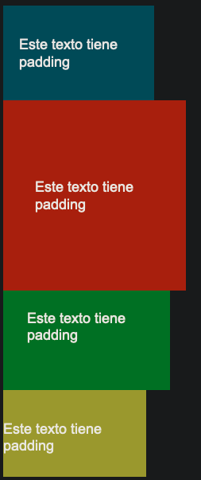

# CSS

- [CSS](#css)
  - [Importar archivo CSS a una página HTML](#importar-archivo-css-a-una-página-html)
  - [Bloque de declaracion](#bloque-de-declaracion)
  - [Unidades](#unidades)
    - [Unidades Absolutas](#unidades-absolutas)
    - [Unidades Relativas](#unidades-relativas)
  - [Selectores](#selectores)
    - [Selectores de elemento](#selectores-de-elemento)
    - [Selectores de ID](#selectores-de-id)
    - [Selectores de clase](#selectores-de-clase)
    - [Elemento con selector de clase](#elemento-con-selector-de-clase)
    - [Consideraciones sobre id y class](#consideraciones-sobre-id-y-class)
    - [Selectores de descendientes](#selectores-de-descendientes)
    - [Child Selector - Selectores de hijos](#child-selector---selectores-de-hijos)
    - [Pseudo-clases](#pseudo-clases)
  - [Box-Model](#box-model)
    - [Tamaño del Contenido](#tamaño-del-contenido)
  - [Posicionamiento](#posicionamiento)
    - [Block](#block)
    - [Inline](#inline)
    - [Alineamiento de un elemento HTML](#alineamiento-de-un-elemento-html)
      - [Centrar un elemento HTML](#centrar-un-elemento-html)
      - [Alinear un elemnto HTML a Izquierda o Derecha](#alinear-un-elemnto-html-a-izquierda-o-derecha)
        - [Float](#float)
        - [Position](#position)
    - [Flex-Box](#flex-box)
      - [Las propiedades del contenedor flex son:](#las-propiedades-del-contenedor-flex-son)
      - [Propiedades de los elementos flex:](#propiedades-de-los-elementos-flex)
      - [Display](#display)
    - [Grid](#grid)
  - [Margenes y padding](#margenes-y-padding)
  - [Box-Sizing](#box-sizing)
  - [Colores](#colores)
    - [RGB](#rgb)
    - [RGBA](#rgba)
    - [HSL](#hsl)
    - [Hexadecimal](#hexadecimal)
    - [Colores predefinidos](#colores-predefinidos)
    - [Algunas Propiedades que son mofidicadas con color](#algunas-propiedades-que-son-mofidicadas-con-color)
  - [Texto](#texto)
    - [Algunas propiedades del texto son las siguientes](#algunas-propiedades-del-texto-son-las-siguientes)
  - [Enlaces](#enlaces)
  - [Responsive Design](#responsive-design)
    - [Flexible Grids](#flexible-grids)
    - [Fuid Images](#fuid-images)
    - [Media Queries](#media-queries)
      - [Fixed grid](#fixed-grid)
      - [Fluid grid](#fluid-grid)
      - [Hybrid grid](#hybrid-grid)
    - [Gradiente](#gradiente)

## Importar archivo CSS a una página HTML

El tag `link` debe tener dos atributos `rel` que especifica el tipo de archivo y `href` especifica la ubicación del archivo, nombre y extensión del archivo

```html
<!DOCTYPE html>
<html>
  <head>
    <link rel="stylesheet" href="style.css" />
  </head>
  <body>
    <p>Some content</p>
  </body>
</html>
```

## Bloque de declaracion

<dl>
    <dt>Selector</dt>
    <dd>Indica qué elemento o elementos html se desea estilar</dd>
    <dt>Propiedad</dt>
    <dd>Indica qué propiedad del selector desdea estilar</dd>
    <dt>Valod de la propiedad</dt>
    <dd>Indica el valor de la propiedad</dd>
</dl>

```css name=style.css
/* HTML Selector */
p {
  color: blue;
  /* Bloque de Declaración */
  /* propiedad: valor */
}
```

## Unidades

### Unidades Absolutas

<dl>
<dt>Pixeles</dt>
<dd>Se define con px. Un píxel es la unidad más pequeña de medición de una pantalla o imagen digital</dd>
<dt>Centímetros (no recomendado)</dt>
<dd>Se define con cm</dd>
<dt>Milímetros (no recomendado)</dt>
<dd>Se define con mm</dd>
<dt>Pulgadas (no recomendado)</dt>
<dd>Se define con in</dd>
</dl>

### Unidades Relativas

<dl>
<dt> em </dt>
<dd> Esta unidad es relativa al tamaño de fuente del elemento. Es decir, si tenemos un tamaño de fuente de 14px, entonces 2em = 28px.</dd>
<dt> rem </dt>
<dd> Similar a em, rem es relativa al tamaño de fuente del elemento raíz, o sea el elemento html </dd>
<dt> Porcentajes </dt>
<dd> Definidos con el símbolo %, hacen referencia al elemento padre, es decir, al contenedor del elemento. Si usamos un margen de 50%, entonces será de la mitad del tamaño del contenedor. </dd>
<dt> vh </dt>
<dd> Es una unidad relativa a la altura del viewport (el espacio en donde está el contenido), donde una unidad 1vh equivale a 1% de la altura de nuestra ventana. </dd>
<dt> vw  </dt>
<dd> Es una unidad relativa al ancho del viewport, donde una unidad 1vw equivale a 1% del ancho de la ventana</dd>
</dl>

## Selectores

Al diseñar una página web, hay muchos tipos de selectores disponibles que permiten a los desarrolladores ser tan amplios o específicos como necesiten al seleccionar elementos HTML a los que aplicar reglas CSS.

### Selectores de elemento

```html
<p>Once upon a time...</p>
<p>In a hidden land...</p>
```

```css
p {
  color: blue;
}
```

### Selectores de ID

Selecciona un elemento unico dentro del documento HTML referenciado con ese atributo, si se desea cambiar el estilo de varios elementos se puede hacer con el atributo `class`

```html
<span id="latest">New!</span>
```

```css
#latest {
  background-color: purple;
}
```

### Selectores de clase

```html
<a class="navigation">Go Back</a>
<p class="navigation">Go Forward</p>
```

```css
.navigation {
  margin: 2px;
}
```

### Elemento con selector de clase

Un método más específico para seleccionar elementos HTML es seleccionar primero el elemento HTML y luego seleccionar la clase CSS o ID.

```html
<p class="introduction"></p>
```

```css
p.introduction {
  margin: 2px;
}
```

### Consideraciones sobre id y class

Los atributos `class` e `id` son globales, lo que quiere decir que se pueden usar en cualquier elemento HTML

- `#` para los <i>id</i>
- `.` para los <i>class</i>

Se puede asignar varias clases a un elemento separando los nombres de las clases con espacio

> [!NOTE]
> Las clases o psudo-clases tienen herencia, si una propiedad se establece a un elemento y si se declara un nuevo elemento dentro del anterio, este nuevo elemento heredara las propiedades del padre
>
> Los elementos deben estar contenidos dentro de otro elemento para que se aplique las caracteristicas que se desean.

```html
  <!-- Html -->
  <div class="azul">
    <h1>Este encabezado no es azul<h1>
    <p>Este texto es azul</p>
  </div>
  <p class="azul">Este texto tampoco es azul<p>
```

```css
/* CSS */

p,
h1 {
  font-size: 28px;
  font-family: Arial, sans-serif;
}

.azul p {
  color: blue;
}
```


### Selectores de descendientes

Los selectores descendientes son útiles si necesita seleccionar elementos HTML que están contenidos dentro de otro selector. La estructura de un selector descendiente es, un selector CSS, seguido de un solo carácter de espacio, seguido de otro selector CSS.

```html
<div id="blog">
  <h1>Latest News</h1>
  <div>
    <h1>Today's Weather</h1>
    <p>The weather will be sunny</p>
  </div>
  <p>Subscribe for more news</p>
</div>
<div>
  <h1>Archives</h1>
</div>
```

```css
#blog h1 {
  color: blue;
}
```

Multiples decendientes pueden ser seleccionados

```css
#blog div h1 {
  color: blue;
}
```

### Child Selector - Selectores de hijos

Los selectores child son más específicos que los selectores descendientes. Solo seleccionan elementos que son descendientes **inmediatos** (hijos) de un selector (el padre). **No se propaga**. La estructura del selector child es un selector CSS seguido del símbolo combinador child `>` seguido de otro selector CSS.

> [!NOTE]
> Tenga en cuenta que esto no irá más allá de un único nivel de profundidad.

```html
<div id="blog">
  <h1>Latest News</h1>
  <div>
    <h1>Today's Weather</h1>
    <p>The weather will be sunny</p>
  </div>
  <p>Subscribe for more news</p>
</div>
```

```css
#blog > h1 {
  color: blue;
}
```

### Pseudo-clases

La pseudoclase permite a los desarrolladores seleccionar elementos en función de su estado. Esta pseudoclase es muy útil para crear efectos visuales basados ​​en la interacción del usuario.

Es una palabra clave que se añade a los selectores y que especifica un estado especial del elemento seleccionado. Por ejemplo, :hover aplicará un estilo cuando el usuario haga hover sobre el elemento especificado por el selector.

```css
selector:pseudoclase {
  propiedad: valor;
}
```

```css
a:hover {
  color: orange;
}
```

La siguiente lista muestra las psudo-clases estandar:

- :active
- :checked
- :default
- :dir()
- :disabled
- :empty
- :enabled
- :first
- :first-child
- :first-of-type
- :fullscreen
- :focus
- :hover
- :indeterminate
- :in-range
- :invalid
- :lang()
- :last-child
- :last-of-type
- :left
- :link
- :not()
- :nth-child()
- :nth-last-child()
- :nth-last-of-type()
- :nth-of-type()
- :only-child
- :only-of-type
- :optional
- :out-of-range
- :read-only
- :read-write
- :required
- :right
- :root
- :scope (en-US)
- :target
- :valid
- :visited

## Box-Model

Cada caja está compuesta de cuatro partes, el contenido, el padding, el borde y el margen


### Tamaño del Contenido

Se puede delimitar el tamaño de contenido con las siguientes propiedades

```css
div {
    width: 1px;
    min-width: 1px;
    max-width: 2px;
    height: 1px;
    min-height: 1px;
    max-height: 2px:
}
```

<dl>
<dt>Padding</dt>
<dd>El padding o cuadro de relleno amplía el tamaño del contenido, su tamaño se conoce como padding box with y padding box height</dd>
<dt>Border</dt>
<dd>El borde rodea el cuadro de relleno y el contenido, su tamaño se conoce como border box width y border box height, puede establecer diferentes tipos de bordes: solid, dashed, dotted, double</dd>

```html
<h1>Some Text</h1>
```

```css
h1 {
  border-width: thin;
  border-width: medium;
  border-width: thick;
}
```

<dt>Margin</dt>
<dd>El margen se extiende por el área del borde para separar el elemento de sus vecinos, su tamaño se conoce como margin box width y margin box height</dd>
</dl>

```css
div {
  margin-top: 1px;
  margin-bottom: 1px;
  margin-left: 1px;
  margin-right: 1px;
}
```

## Posicionamiento

La forma habitual en la que los navegadores web calculan la posición de los elementos HTML en pantalla se denomina **flujo del documento** (**document flow**), por defecto casi todos los elementos HTML se organizan en una de dos categorías:

- elementos en bloque `block`
- elementos en línea `inline`

### Block

Un elemento de nivel de bloque ocupará todo el ancho horizontal de su elemento padre y la altura vertical de su contenido. Cada elemento bloque tentrá una nueva línea antes y después, algunos elementos en bloque son los siguientes:

```html
<div></div>
<form></form>
<h1></h1>
<h2></h2>
<h3></h3>
<h4></h4>
<h5></h5>
```

### Inline

Los elemento en línea solo ocupan el ancho y alto de su contenido, no aparecen en una nueva línea, por lo tanto varios elmentos en línea pueden formar una fila de elementos, algunos elementos en línea son los siguientes:

```html
<a href="index.html"></a>

<input />
<label></label>
<b></b>
<i></i>
<em></em>
<span></span>
```

### Alineamiento de un elemento HTML

#### Centrar un elemento HTML

Para alinear elementos HTML, debe tener en cuenta el modelo de caja y el flujo del documento. La alineación de un elemento HTML se realiza modificando las propiedades de su modelo de caja y su impacto en el flujo del documento.

Para centrar un elemento, establezca un ancho en el elemento y empuje sus márgenes hacia afuera para llenar el espacio disponible restante del elemento principal como en la siguiente estructura HTML:

```html
<div class="parent">
  <div class="child"></div>
</div>
```

El elemento child tendrá un ancho igual al 50 % del elemento principal con un relleno de 20 píxeles. Para visualizar el espacio que ocupa, establezca el borde.

Para alinear el elemento al centro, configure la propiedad margin en auto. La opción auto le indicará al navegador que calcule el margen automáticamente en función del espacio disponible.

```css
.parent {
  border: 4px solid red;
}

.child {
  width: 50%;
  padding: 20px;
  border: 4px solid green;
  margin: auto;
}
```


> [!TIP]
> Es importante tener en cuenta que esto funciona porque el elemento div es un elemento de nivel de bloque.

Si desea alinear un elemento en línea como img, deberá cambiarlo a un elemento de nivel de bloque

```html
<div class="parent">
  
</div>
```

```css
.child {
  display: block;
  width: 50%;
  margin: auto;
}
```

Para ser más preciso, en CSS puede configurar solo los márgenes izquierdo y derecho como automáticos. Esto te permite configurar los márgenes superior e inferior con valores específicos si es necesario.

```css
.child {
  display: block;
  width: 50%;
  margin-left: auto;
  margin-right: auto;
}
```

#### Alinear un elemnto HTML a Izquierda o Derecha

Las dos formas más comunes de alinear elementos a la izquierda y a la derecha son usar la propiedad `float` y la propiedad `position`.

##### Float

La propiedad float establece la posición de un elemento en relación con el contenido de texto dentro de un elemento principal. El texto se ajustará alrededor del elemento. Ubica un elemento al lado izquierdo o derecho de su contenedor, permitiendo a los elementos de texto y en línea aparecer a su costado. Los posibles valores son <strong> none, left, right, inline-start, inline-end</strong>

<table>
<tr>
<td> left </td>
<td> El elemento debe flotar a la izquierda de su bloque contenedor </td>
</tr>
<tr>
<td> right </td>
<td> El elemento debe flotar a la derecha de su bloque contenedor </td>
</tr>
<tr>
<td> none </td>
<td> El elemento no deberá flotar </td>
</tr>
<tr>
<td> inline-start </td>
<td> El elemento debe flotar en el costado de inicio de su bloque contenedor </td>
</tr>
<tr>
<td> inline-end </td>
<td> El elemento debe flotar en el costado de término de su bloque contenedor </td>
</tr>
</table>

```html
<div class="parent">
   Lorem ipsum dolor sit amet, consectetur
  adipiscing elit. Curabitur eu odio eget leo auctor porta sit amet sit amet
  justo. Donec fermentum quam in diam volutpat, at lacinia diam placerat. Aenean
  quis feugiat sem. Suspendisse a dui massa. Phasellus scelerisque, mi
  vestibulum iaculis tristique, orci tellus gravida nisi, in pellentesque elit
  massa ut lorem. Sed elementum ornare nunc vel cursus. Duis sed enim in nulla
  efficitur convallis sed eget dolor. Curabitur scelerisque eros erat, in
  vulputate dolor consequat vel. Praesent ac sapien condimentum, ultricies
  libero at, auctor orci. Curabitur ut augue ac massa convallis faucibus sed in
  magna. Phasellus scelerisque auctor est a auctor. Nam laoreet sem sapien,
  porta imperdiet urna laoreet eu. Morbi dolor turpis, congue id bibendum eget,
  viverra et risus. Quisque vitae erat id tortor ullamcorper maximus.
</div>
```

```css
.child {
  float: right;
}
```


##### Position

### Flex-Box

[Juego Flex](https://flexboxfroggy.com/#es)

"Caja Flexible" es una propiedad que se utliza para que los elementos se acomoden de acuerdo al tamaño de página. Para utilizarla, se tiene que agregar <i>display: flex;</i> al elemento padre, con esto todos los elementos dentro del elemento se convertiran en cajas flexibles, y se les podrá aplicar una serie de propiedades. Existen propiedades flex para el contenedor y para los hijos; las propiedades del contenedor afectan todos los hijos.

#### Las propiedades del contenedor flex son:

<dl>
<dt> flex-direction </dt>
<dd> Cambia la dirección en la que se acomodan los elementos. La predeterminada es <i>row</i>, la cual acomoda a los elementos de manera horizontal de izquierda a derecha <dd>
<dt> flex-wrap </dt>
<dd> Si el contenido no cabe en la dirección que se tiene entonces se "rodea" con el valor <i>wrap</i><dd>
<dt> align-items </dt>
<dd> Modifica cómo se alinean los elementos respecto a los demás<dd>
<dt> justify-content </dt>
<dd> Modifica cómo se justifica el contenido<dd>
<dt> align-content </dt>
<dd> Modifica cómo se alinean los elementos respecto al contenedor<dd>
</dl>

#### Propiedades de los elementos flex:

<dl>
<dt> align-self </dt>
<dd> Alinea sólo al elemento dentro del contenedor. Esta propiedad anulará la propiedad <i>align-items</i> sólo en el elemento<dd>
<dt> flex-grow </dt>
<dd> Especifica el tamaño con el que crecerá un elemento con respecto a los demás. Su valor predeterminado es 0<dd>
<dt> flex-shrink </dt>
<dd> Especifica el tamaño con el que decrecerá un elemento con respecto a los demás. Su valor predeterminado es 1<dd>
<dt> flex </dt>
<dd> Combina las tres propiedades anteriores<dd>
<dt> order </dt>
<dd> Cambia el orden de los elementos; el valor debe de ser un número, el más bajo va primero<dd>
</dl>

#### Display

Esta propiedad cambia la forma en la que se muestra el contenido. Tiene dos valores por defecto los cuales son: <i> inline </i> para objetos de línea (enlaces, spans, labels) y <i> block </i> para objetos de bloque (divisiones, párrafos, listas). Existen otros valores como <i> inline-block </i> que combina los dos anteriores

---

### Grid

[Explicacion Detallada](https://lenguajecss.com/css/maquetacion-y-colocacion/grid-css/)

[Juego Grid](https://cssgridgarden.com/#es)


- Contenedor: El elemento padre contenedor que definirá la cuadrícula o rejilla.
- Ítem: Cada uno de los hijos que contiene la cuadrícula (elemento contenedor).
- Celda (grid cell): Cada uno de los cuadritos (unidad mínima) de la cuadrícula.
- Area (grid area): Región o conjunto de celdas de la cuadrícula.
- Banda (grid track): Banda horizontal o vertical de celdas de la cuadrícula.
- Línea (grid line): Separador horizontal o vertical de las celdas de la cuadrícula.

<br>

Grid es una propiedad más avanzada pues permite estilizar el espacio como una cuadrícula la cual tiene dos dimensiones, usando filas y columnas. Para implentarlo, se utiliza <i> display: grid;</i> y después se tiene que especificar los tamaños de las filas y columnas con las propiedades: <i>grid-template-rows</i> y <i>grid-template-columns;</i> puedes especificar uno o ambos. Esto se puede hacer de diferentes maneras, ejemplos:

- grid-template-rows: 100px 1fr;

  Dos renglones, uno de 100px y otro de 1fr. (fr es una unidad exclusiva de grid).

- grid-template-rows: minmax(100px, 1fr);

  La función minmax nos da un rango mínimo y máximo de valores que puede tener el renglón o columna.

- grid-template-rows: repeat(3, 200px);

  La función repeat repite los valores. El primer número indica la cantidad de veces a repetir y el segundo el tamaño, por lo que en este caso tendremos tres renglones de 200px.

<br>
Otras propiedades que se pueden aplicar a un contenedor grid son:

- grid-row-gap Especifica el espacio entre cada renglón.
- grid-column-gap Especifica el espacio entre cada columna.
- grid-gap Especifica el espacio entre cada renglón y columna.

<br>
Estas propiedades se utlizan en los elementos del contenedor para especificar el espacio del grid que tomarán:

- grid-column-start Indica la columna en la que comenzará el elemento.
- grid-column-end Indica la columna en la que terminará el elemento.
- grid-row-start Indica el renglón en el que comenzará el elemento.
- grid-row-end Indica el renglón en el que terminará el elemento.
- grid-area Se utiliza para los 4 anteriores. También puede utilizarse con <i>grid-template-areas</i> para especificar áreas del grid a utilizar

Ejemplo

```html
<!-- HTML -->

<header>encabezado</header>
<nav>nav</nav>
<section>sección</section>
<aside>lado derecho</aside>
<footer>pie de página</footer>
```

```css
/* CSS */

body {
  font-family: segoe-ui_normal;
  color: white;
  font-size: 18px;
  display: grid;
  grid-template-areas:
    "header header header"
    "nav section aside"
    "footer footer footer";
  grid-template-rows: 80px 1fr 50px;
  grid-template-columns: 15% 1fr 18%;
  grid-gap: 5px;
  height: 100vh;
  margin: 10px;
}

header {
  background: #707070;
  grid-area: header;
}

nav {
  background: #c9bfbf;
  grid-area: nav;
}

section {
  background: #ababab;
  grid-area: section;
}

aside {
  background: #c9c9c9;
  grid-area: aside;
}

footer {
  background: #707070;
  grid-area: footer;
}

header,
nav,
section,
aside,
footer {
  padding: 5px;
}
```


---

Para cualquier elemento se dispone de la etiqueta <i>position</i>

<table>
<tr>
<td> static </td>
<td> posicionamiento predeterminado (de arriba a abajo) </td>
</tr>
<tr>
<td> relative </td>
<td> El elemento permanece donde esta pero puede ser afectado por las propiedades <i> top botom left </i> y <i>right</i></td>
</tr>
<tr>
<td> absolute </td>
<td> Muestra al elemento en una posición absoluta dentro de su elemento padre/contendor. A diferencia de relative, los elementos alrededor de un elemento absoluto no se reposicionan alrededor de su posición inicial</td>
</tr>
<tr>
<td> fixed </td>
<td> Permite que el elemento se mantenga visible en la ventana en todo momento (incluso después desplazar la página)</td>
</tr>
<tr>
<td> sticky </td>
<td> Se comporta como relative hasta que comienza a "salirse" de la ventana. Ahí es cuando se comporta como fixed, manteniendo su posición en la parte superior de la ventana hasta que su elemento padre deje de estar visible</td>
</tr>
</table>

## Margenes y padding

Los márgenes son la distancia que separa a un elemento de otro, mientras que el padding es la distancia del contenido de un elemento a su borde

- margin: 20px; y padding: 20px;

  Utilizar un solo valor modifica uniformemente los márgenes y padding en las 4 direcciones (arriba, abajo, izquierda y derecha).

- margin: 80px 40px; y padding: 80px 40px;

  Cuando utilizamos 2 valores, el primer valor corresponde a la distancia vertical y el segundo la horizontal.

- margin: 20px 100px 30px; y padding: 20px 100px 30px;

  Para 3 valores, el primer valor corresponde al margen o padding de arriba, el segundo a la distancia horizontal y el tercero al de abajo.

- margin: 20px 30px 10px 0px; y padding: 20px 30px 10px 0px;
  Si utilizamos 4 valores, el primer valor corresponde al margen o padding de arriba, el segundo al de la derecha, el tercero al de abajo y el cuarto al de la izquierda.

Si solo se desea modificar el margen o padding en una direccion especifica se usa:

- margin-left o padding-left: izquierda
- margin-right o padding-right: derecha
- margin-top o padding-top: arriba
- margin-bottom o padding-bottom: abajo

Las margenes tambien pueden aceptar otro valor <i> auto </i> el cual permite que el navegador calcule el valor, se usa comunmente para centrar elementos

```html
<!-- HTML -->

<div class="padre">
  Este es el elemento padre.
  <div class="hijo">Este elemento está centrado usando márgenes</div>
</div>
```

```css
/* CSS */

.padre {
  background-color: #d5f5e3;
}

.hijo {
  width: 30%;
  margin: auto;
  background-color: #f6ddcc;
  text-align: center;
}

body {
  font-size: 18px;
  font-family: Arial, sans-serif;
}
```


## Box-Sizing

box-sizing = border-box, se usa para que el padding que se agregue no aumente el tamaño del contenedor




## Colores

A partir de la versión 3 de CSS, hay cinco formas principales de hacer referencia a un color.

- RGB
- RGBA
- HSL
- Valor hexadecimal
- Nombres de colores predefinidos

### RGB

RGB es un modelo de color que suma los colores rojo (R), verde (G) y azul (B) para crear colores. Esto se basa en cómo el ojo humano ve los colores.

Cada valor se define como un número entre 0 y 255, que representa la intensidad de ese color.

```css
p {
  color: rgb(255, 0, 0);
}
```

### RGBA

RGBA es una extensión de RGB que agrega un canal alfa (A). El canal alfa representa la opacidad o transparencia del color.

```css
p {
  color: rgba(255, 0, 0, 0.8);
}
```

### HSL

HSL es un modelo de color más nuevo definido como Tono (H), Saturación (S) y Luminosidad (L). El objetivo del modelo es simplificar la visualización mental del color que representa el valor.

Piense en un arcoíris que se ha convertido en un círculo completo. Esto representa el Tono. El valor del Tono es el valor del grado en este círculo, de 0 grados a 360 grados. 0 es rojo, 120 es verde y 240 es azul.

La saturación es la distancia desde el centro del círculo hasta su borde. El valor de saturación se representa mediante un porcentaje del 0 % al 100 %, donde el 0 % es el centro del círculo y el 100 % es su borde. Por ejemplo, el 0 % significa que el color es más gris y el 100 % representa el color completo.

La luminosidad es el tercer elemento de este modelo de color. Piense en ello como si convirtiera el círculo en un cilindro 3D donde la parte inferior del cilindro es más negra y hacia la parte superior es más blanca. Por lo tanto, la luminosidad es la distancia desde la parte inferior del cilindro hasta la parte superior. Nuevamente, la luminosidad se representa mediante un porcentaje del 0 % al 100 %, donde el 0 % es la parte inferior del cilindro y el 100 % es su parte superior. En otras palabras, el 0 % significará que el color es más negro y el 100 % es blanco.


- El primer valor es matiz, valor entre 0 y 359
- Saturacion, porcentaje de 0 a 100%
- Luminosidad , porcentaje de 0 a 100%

```css
p {
  color: hsl(0, 100%, 50%);
}
```

> [!NOTE]
> Cuando se desea cambiar la opacidad o transparencia se usa la codificacion RGBA o HSLA, en donde a es un valor entre 0 y 1, el 0 es totalmente transparente y 1 es color solido

<table>
<tr>
<th> RGBA </th>
<th> HSLA </th>
</tr>
<tr>
<td> rgba(0, 0, 0, 0.5)</td>
<td> hsl(123, 100%, 0%, 0.5)</td>
</tr>
</table>

### Hexadecimal

Los colores especificados mediante formato hexadecimal tienen como prefijo el símbolo # seguido del valor RGB en formato hexadecimal.

```css
p {
  color: #ff0000;
}
```

### Colores predefinidos

Los navegadores web modernos admiten 140 nombres de colores predefinidos. Estos nombres de colores se utilizan para facilitar su uso y se pueden asignar a valores hexadecimales/RGB/HSL equivalentes.

A continuación se enumeran algunos nombres de colores comunes disponibles.

- black
- silver
- gray
- white
- maroon
- red
- purple
- fuchsia
- green
- lime
- olive
- yellow
- navy
- blue
- teal
- aqua

<table>
<tr>
<th> hexadecimal </th>
<th> RGB </th>
<th> HSL </th>
</tr>
<tr>
<td> #1234AB </td>
<td> rgb(0, 0, 0)</td>
<td> hsl(123, 100%, 0%)</td>
</tr>
</table>

### Algunas Propiedades que son mofidicadas con color

<table>
<tr>
<td> color </td>
<td> Especifica el color del texto </td>
</tr>
<tr>
<td> background-color </td>
<td> Especifica el color del fondo </td>
</tr>
<tr>
<td> border-color </td>
<td> Especifica el color del borde </td>
</tr>
<tr>
<td> box-shadow </td>
<td> Añade una sombra al contenedor con el color especificado </td>
</tr>
<tr>
<td> text-shadow </td>
<td> Agrega una sombra del color especificado al texto </td>
</tr>
<tr>
<td> text-decoration-color </td>
<td> Cambia el color de la decoracion aplicada al texto </td>
</tr>
</table>

## Texto

- Para agregar fuentes a la pagina se pueden descargar (formato .tff) y vincular la fuente de la siguiente manera:

```css
@font-face {
  font-family: NombreDeLaFuente;
  src: url("NombreDeLaFuente.ttf");
}
```

- Otra forma de importar la fuente es utilizando la etiqueta <i> link </i> y copiando el link generado en <b>Google Fonts </b>
- Tambien se puede importar la fuente con el tag <i> @import </i> desde Html en la etiqueta <i> style </i>

Despues de importada se usa en el elemento usando la propiedad <i>font-family = "NombreDeLaFuente"</i>

Dado que las fuentes que vienen instaladas varían según el equipo, se recomienda incluir varias fuentes al utilizar la propiedad `font-family`. Estas se especifican en un orden de alternativas, lo que significa que si la primera fuente no está disponible, se buscará la segunda. Si la segunda fuente no está disponible, se buscará la tercera y así sucesivamente. Si ninguna de las fuentes está disponible, se utilizará la fuente predeterminada del navegador.

```css
p {
  font-family: "Courier New", monospace;
  font-size: 12px;
}
```

### Algunas propiedades del texto son las siguientes

<table>
<tr>
<td> color </td>
<td> Cambia el color del texto </td>
</tr>
<tr>
<td> font-size </td>
<td> Tamaño de la fuente </td>
</tr>
<tr>
<td> font-weight </td>
<td> Cambia el grosor de la fuente, toma valores como bold o light. Para utilizar estas variaciones de grosor hay que tenerlas descargadas o vinculados a tus archivos. </td>
</tr>
<tr>
<td> font-family </td>
<td> Cambia la familia de fuentes. Se utiliza como una lista separada por comas: si la primera fuente falla, se utiliza la segunda y así sucesivamente </td>
</tr>
<tr>
<td> text-decoration </td>
<td> Agrega decoración al texto. Por ejemplo, el valor de underline subraya al texto </td>
</tr>
<tr>
<td> text-align </td>
<td> Alinea al texto en su contenedor de diferentes maneras. Puede ser <i>left, right, center, justify </td>
</tr>
</table>

## Enlaces

Estilizar enlaces es igual que estilizar texto. Por defecto, cuando se pone un enlace en HTML el texto cambia a color azul y se subraya. Se puede modificar su estilo utilizando las propiedades <i> text-decoration, color </i>

También se puede modificar el estilo del enlace cuando el usuario hace clic sobre él o pasa el puntero sobre texto. Esto se logra a través de pseudoclases de CSS, que se utilizan para modificar un elemento sólo bajo ciertas condiciones. En los enlaces se utiliza la pesudoclase hover para modificar el texto cuando el usuario pasa el puntero del mouse sobre él.

```
a{
    font-size: 30px;
    text-decoration: none;
}

a:hover{
    color: red;
}
```

## Responsive Design

Las pantallas de teléfonos, las tabletas y los ordenadores están formadas por miles de pixeles, lo cual complica el diseño de paginas web dado que cada dispositivo tiene resolución diferente.

las pantallas de alta resolución en los dispositivos móviles

- Agrupan múltiples píxeles fisicos en uno lógico para mostrar imágenes y textos más fluidos, permitiendo suavizar los bordes de las imágenes, suavizar el texto y los píxeles individuales sean menos visibles

El diseño dinámico es un conjunto de tres prácticas que permiten que un sitio web cambie automáticamente sus objetos visuales, es decir, permiten al sitio web responder en función del dispositivo en el que se visualiza. Las tres técnicas son:

- Cuadículas flexibles - Flexible grids
- Imágenes fluidas - Fluid Images
- Consulta del medio - Media queries

Muchos frameworks de diseño dinámico proporcionan múltiples reglas CSS basados en diferentes tamaños de dispositivos para ofrecer mejor experiencia visual

### Flexible Grids

Las cuadrículas flexibles se componen de columnas _columns_, el espacio entre ellas se llama canal _gutter_ y los espacios entre en el contenido y los bordes derecho e izquierdo de la pantalla se denominan márgenes _margin_

En lugar de definir el tamaño de los sitios web en función de los píxeles, las cuadrículas flexibles se definen en valores porcentuales, lo que permite que se ajuste al tamaño de la pantalla

### Fuid Images

Puede lograr imágenes fluidas estableciendo la propiedad de ancho máximo de las imágenes al 100% `max-width: 100%;`, las imágenes se reducirán en tamaño si las columnas se vuelven más angostas que el tamaño de la imágen, pero nunca se aumentará su tamaño ni se pixelará si la columna se ensancha más que la imágen

### Media Queries

Las media queries o consultas de medios permiten consultar la orientación del tamaño de la pantalla, la orientación de la pantalla y la relación de aspecto para aplicar reglas CSS de forma condicional. Se implementan con la regla de CSS `@media`. Típicamente se utilzan para cambiar el estilo cuando una pantalla llega a cierta anchura, en diseño dinámico el valor de píxel específicado se denomina punto de interrupción **breakpoint**.

Un breakpoint puede funcionar de diferentes maneras a través de tres cuadrículas diferentes:

- Fixed grids - cuadricula fija
- Fluid grids
- Hybrid grids

#### Fixed grid

Tiene columnas fijas y márgenes flexibles, la cuadrícula fika tiene un contenido fijo que no cambia en un rango especifico de breakpint, mientras que los márgenes flexibles ocupan el espacio restante


#### Fluid grid

Cuadrículas fluidas o de ancho total con columnas de ancho total y canal (**gutter**) fijo y márgenes laterales fijos. La cuadricula fluida tiene un ancho de contenido flexible que se extiende de borde a borde según el tamaño de pantalla. Las columnas se expanden o reducen para adaptarse al espacio disponible


#### Hybrid grid

Tienen ancho fluido y fijo con compnentes

```html
<!-- HTML -->

<div id="container">
  <div class="row">
    <div class="col one">
      <p>Texto 1</p>
    </div>
    <div class="col two">
      <p>Texto 2</p>
    </div>
  </div>
</div>
```

```css
/* CSS */

.col {
  font-size: 20px;
  font-family: Arial, sans-serif;
  text-align: center;
  color: #fff;
  float: left;
  margin: 10%;
  width: 30%;
}

.one {
  background-color: #e95b33;
}

.two {
  background-color: #40b7d7;
}

@media screen and (max-width: 400px) {
  .col {
    float: none;
    margin: 0 auto;
    width: 80%;
  }
}
```


Otros Ejemplos

```css
@media screen and (min-width: 30em) and (orientation: landscape) {
  /* … */
}

@media (min-height: 680px), screen and (orientation: portrait) {
  /* … */
}
```

### Gradiente

linear-gradient(#ffffff, #8D848461);
